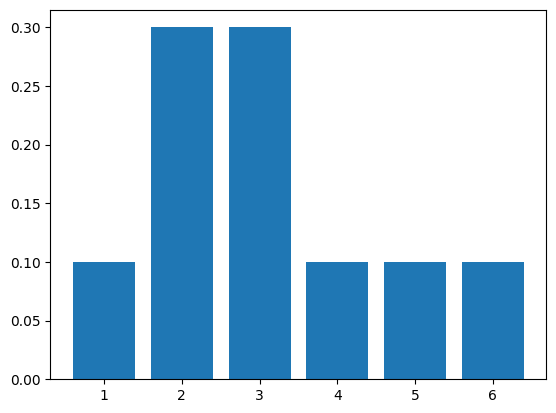
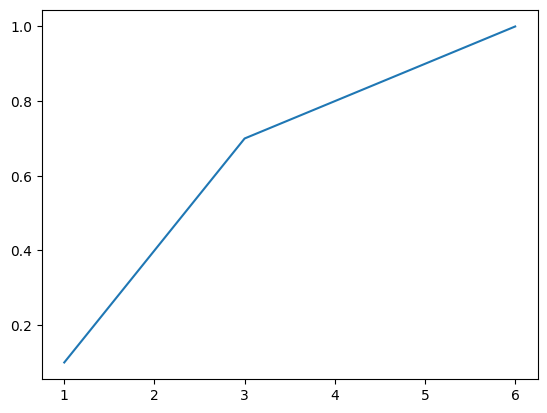

# Problem 1
## Finding the MLE
We will try to fit a Bernoulli distribution to the given samples. We assume  $X \sim \text{Bernoulli}(\theta)$, such that
$$P(X = x) = \begin{cases} \theta & x = G \\
 (1 - \theta) & x = B. \end{cases}$$
and try to find $\hat\theta$ that maximizes $p_\theta(X_i = x_i : i = 1, \dots, n)$. In our instance of the problem, $n = 6$.

### General Case
Let us consider the general case of $n$ samples, of which $k$ samples are $G$ and $n-k$ are $B$ (we assume that $0 < k < n$). Then, we have
\begin{align}
p_\theta(X_i = x_i : 1, \dots, n) &= \prod_{i = 1}^n p_\theta(X_i = x_i) \text{ [i.i.d samples]}\\
&= \left(\prod_{i = 1}^k p_\theta(X_i = G)\right)\left(\prod_{i=k+1}^{n} p_\theta(X_i = B) \right) \\
&= \theta^k (1-\theta)^{n-k}.
\end{align}.

For the MLE $\hat\theta$, we differentiate w.r.t $\theta$ to get
\begin{align}
\frac{d}{d\theta}p_\theta &= \theta^k \cdot (n-k) \cdot (1-\theta)^{n-k-1} \cdot (-1) + k \cdot \theta^{k-1} \cdot (1-\theta)^{n-k} \\
&= \theta^{k-1}(1-\theta)^{n-k-1}(k(1-\theta)-(n-k)\theta) \\
&= \theta^{k-1}(1-\theta)^{n-k-1}(k - n\theta).
\end{align}

This gives us $\hat\theta = \frac{k}{n}$. To verify that this is a maxima, we differentiate again:
\begin{align}
\frac{d^2}{d\theta^2}p_\theta &= \theta^{k-1}(1-\theta)^{n-k-1}\cdot(-n) \\
&+ \theta^{k-1}(k-n\theta) \cdot (n-k-1)(1-\theta)^{n-k-2}(-1) \\
&+ (1-\theta)^{n-k-1}(k-n\theta) \cdot (k-1)\theta^{k-2} \\
&= \theta^{k-2}(1-\theta)^{n-k-2}(-n\theta(1-\theta) - (n-k\theta)(\dots)).
\end{align}

The term outside the brackets is positive for any $\theta \in (0, 1)$, and so we can ignore it. Inside the brackets, the second term is zero for $\theta = \hat\theta$, and so we can ignore this as well. Thus the sign of the second derivative is given by the sign of the first term in the brackets, which is
$$\left[-n\theta(1-\theta)\right]_{\theta=\frac{k}{n}} = -\frac{k(n-k)}{n} < 0.$$
Therefore $\hat\theta$ gives a maxima, as required.

### Specific Case
We note that our instance of the problem is given by $n = 6$ and $k = 4$. Thus we conclude the value of $\hat\theta$ is $\frac46 = \frac23$ for us, and therefore the learned distribution is $\text{Bernoulli}\left(\frac23\right)$.

## Generating Samples
Using the command `np.random.binomial(1, p=2/3)`, we obtain the samples $(0, 1, 1)$, corresponding to $(B, G, G)$.

# Problem 2
## Generating by Hand
We are given ten samples $\{1, 3, 2, 4, 2, 3, 5, 6, 3, 2\}$ from the roll of a six-sided die. The PMF values according to these samples are
\begin{align*}
P(1) &= \frac1{10} \\
P(2) &= \frac3{10} \\
P(3) &= \frac3{10} \\
P(4) &= \frac1{10} \\
P(5) &= \frac1{10} \\
P(6) &= \frac1{10}
\end{align*}

## Graphs
See Figure 1 for the PMF graph and Figure 2 for the CDF graph.




The CDF graph is both strictly increasing and invertible.

If a CDF is strictly increasing, it must be invertible. We know this as the range of a CDF function is known to be $[0, 1]$ (it is a surjection), and if it is strictly increasing, it must be an injection.

We generate a uniform sample in $[0, 1]$ using `np.random.uniform(0, 1)`. This turns out to be 0.832, which is closest to 0.8 – thus we generate the sample 4.

## Generating by Code
The code for this approach is in the accompanying `q2.py` file.

# Problem 3
## Learning the Distributions
We will assume that all the distributions $\theta_i, i = 1, \dots, n$, are Bernoulli distributions (conditional in the case of $i > 1$), where $\theta_i$ corresponds to the probability of 1 and $1-\theta_i$ to that of 0. We will use the MLE estimate for each of these.

We have seen in Problem 1 that the MLE estimate is given by $\hat\theta_i = \frac{k}{n}$, where $k$ is the number of samples which correspond to 1, and $n$ is the total number of samples. We will use this general formula to evaluate the MLE for each distribution.

### Initial $\theta_1$
We observe that five of the 12 samples ($s_1, s_3, s_6, s_7, s_{10}$) have the first gene as 1. Thus we conclude that
$$\hat\theta_1 = \frac5{12}.$$

### Other $\theta_i$
The following table, extracted from the list of samples, helps us to estimate the remaining $\theta_i$.

 Position    #1's following 1  #1's following 0
-----------  ----------------- -----------------
2            3                 2
3            2                 2
4            2                 3
5            1                 4
6            3                 4
7            2                 4
8            2                 4
9            3                 4
10           6                 1

Thus we can compute the following values for $\hat\theta_i$.
\begin{align*}
\hat\theta_2^1 = \frac35 &; \hat\theta_2^2 = \frac27 \\
\hat\theta_3^1 = \frac25 &; \hat\theta_3^2 = \frac27 \\
\hat\theta_4^1 = \frac12 &; \hat\theta_4^2 = \frac38 \\
\hat\theta_5^1 = \frac15 &; \hat\theta_5^2 = \frac47 \\
\hat\theta_6^1 = \frac35 &; \hat\theta_6^2 = \frac47 \\
\hat\theta_7^1 = \frac27 &; \hat\theta_7^2 = \frac45 \\
\hat\theta_8^1 = \frac13 &; \hat\theta_8^2 = \frac23 \\
\hat\theta_9^1 = \frac12 &; \hat\theta_9^2 = \frac23 \\
\hat\theta_{10}^1 = \frac67 &; \hat\theta_{10}^2 = \frac15 \\
\end{align*}

## Generating Samples
We use the code in the accompanying file `q3_1.py` to generate ten samples according to the above parameters. The generated samples are:
```
[1, 0, 0, 0, 1, 1, 0, 0, 0, 0]
[0, 0, 0, 1, 1, 0, 1, 0, 1, 1]
[0, 0, 0, 0, 0, 1, 0, 1, 1, 1]
[0, 0, 0, 1, 0, 1, 0, 1, 0, 0]
[0, 1, 0, 1, 0, 1, 0, 1, 1, 1]
[0, 0, 0, 1, 0, 0, 1, 0, 1, 0]
[1, 0, 1, 1, 0, 0, 0, 1, 1, 1]
[1, 1, 1, 1, 1, 1, 1, 0, 1, 1]
[0, 0, 0, 0, 0, 0, 1, 1, 1, 1]
[1, 1, 1, 1, 0, 1, 0, 1, 1, 1]
```

Only six of these samples ($s_2, s_3, s_5, s_7, s_8, s_{10}$) correspond to intelligent humans. Thus the chain rule method is not good enough for this.

This is because we only condition on one previous sample but search for subsequences of length 3. There is no way for the parameters to incorporate memory of the second previous sample to decide the distribution for current one.

## History-Based Sampling
Using the code in the accompanying file `q3_2.py`, we learn Bernoulli distributions via MLE conditioned on two previous samples. The generated samples based on these parameters are as follows.

```
[0, 1, 0, 0, 1, 0, 1, 0, 1, 1]
[1, 0, 1, 0, 0, 1, 0, 0, 0, 0]
[0, 0, 0, 1, 0, 1, 0, 1, 1, 1]
[1, 0, 1, 1, 1, 1, 0, 0, 0, 0]
[1, 1, 0, 0, 1, 1, 1, 0, 1, 1]
[0, 0, 0, 1, 0, 1, 0, 0, 0, 1]
[1, 0, 1, 0, 0, 0, 0, 0, 0, 1]
[0, 0, 0, 1, 0, 0, 1, 0, 1, 1]
[1, 1, 1, 0, 0, 0, 1, 1, 1, 1]
[0, 1, 1, 1, 0, 1, 1, 0, 0, 1]
```

Here, we have six samples corresponding to intelligent humans ($s_1, s_3, s_4, s_5, s_8, s_{10}$). Thus this does not improve upon the previous method significantly.

However, we note that 9 of the above samples include the string `[1, 0, 1]`, while the previous method only generated 8 such samples. Thus we can conclude that this *may* be better for this substring – we can increase our confidence by examining more samples.

In general, to identify a string of length $l$, it would make sense to condition on $l-1$ previous samples.

As long as we use MLE, the ordering of samples plays no role; we only count samples satisfying our posteriors and priors and use these counts for estimates. More complicated methods of learning distributions, like backprop-based neural systems, are influenced by the ordering of samples.

In the case of greyscale images, we can implement a window-based dependence (inspired by CNNs). For each pixel, we can condition the distribution on those of the surrounding pixels which are already generated (*i.e.,* those to the top and left).  
We can also change the order of generation; for instance, we may generate the edge pixels before moving inwards. The idea of generating the values with least dependences first comes from the linear generating method we use in Markovian processes.

As the pixels are greyscale values, we need to learn continuous distributions. Thus the above method of MLE will not work; it would be more appropriate to use *e.g.* neural methods.