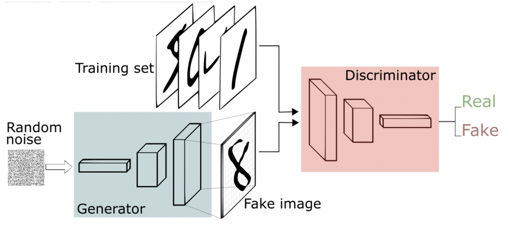
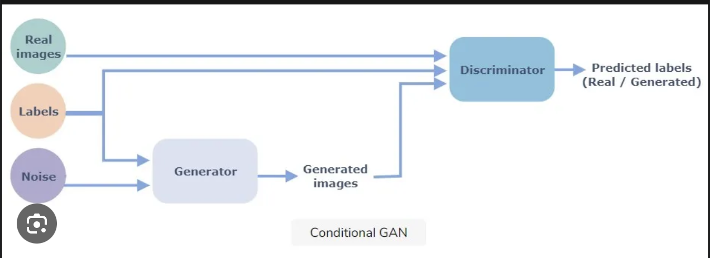

\newcommand{\argmin}{\operatorname*{argmin}}
\newcommand{\argmax}{\operatorname*{argmax}}

Wherever there's `(?)`, it's my own definition, not from anywhere.

# Basic Definitions
## Maximum Likelihood Estimation
[informal]  
The estimation of parameters according to some probability model so as to maximize the likelihood of the observed sequence.

[formal]  
Let $X_1, \dots, X_n$ be a random sample drawn from a distribution $p_\theta$, whose values we have observed as $x_1, \dots, x_n$.  
A maximum likelihood estimate of $\theta$, denoted $\hat{\theta}_\text{ML}$, is the value of $\theta$ that maximizes the likelihood function
$$L(x_1; \cdots; x_n; \theta).$$

## Normal Distribution
$$f_X(x) = \frac1{\sigma\sqrt{2\pi}} e^{-\frac12\left(\frac{x-\mu}{\sigma}\right)^2}.$$

## Binomial Distribution
$$P_X(k) = {n \choose k} p^k(1-p)^{n-k}.$$

## Uniform Distribution
$$P_X(k) = \frac1n; k \in [1, n].$$
$$f_X(x) = \frac{1}{b-a}; x \in [a, b].$$

## Poisson Distribution
$$P_X(k) = \frac{\lambda^k}{k!}e^{-\lambda}.$$

## Independent Random Variables (?)
Two RVs $X \sim P_X$, $Y \sim P_Y$ are said to be independent if their distributions satisfy
$$P(X = x, Y = y) = P_X(x) \cdot P_Y(y); x \in \mathcal{X}, y \in \mathcal{Y}.$$

## Law of Total Probability
$$P_X(x) = \sum_{y \in \mathcal{Y}}P_{X \mid Y}(x \mid y) P_Y(y).$$

## MAP Estimate
Given an estimate of the posterior distribution $P_{X \mid Y}$ for the unknown value $X$, given $Y = y$, the value $x$ of $X$ that maximizes $P(x \mid Y = y)$ is called the maximum a priori (MAP) estimate.

In practice, we maximize $P_{Y \mid X}(y \mid x)P_X(x)$ instead.

## Biased and Unbiased Estimator
The bias of an estimator $\hat{\Theta}$ is defined as
$$B(\hat{\Theta}) = \mathbb{E}[\hat{\Theta}] - \theta.$$
An unbiased estimator is one that is identically zero.

## Random Sample
A collection of random variables $X_1, \dots, X_n$ is a random sample of size $n$ if it is i.i.d.

## Central Limit Theorem
If $X_1, \dots, X_n$ are i.i.d RVs with finite mean $\mu$ and finite variance $\sigma^2$, then the random variable
$$Z_n = \frac{\bar{X}-\mu}{\frac{\sigma}{\sqrt{n}}}$$
converges to the standard normal variable $\mathcal{N}(0,1)$ as $n$ tends to infinity.

## Law of Large Numbers
The Weak Law of Large Numbers states that, for i.i.d RVs $X_1, \dots, X_n$ with mean $\mu$,
$$\lim_{n \to \infty} P(|\bar{X}-\mu| \geq \varepsilon) = 0$$
for any $\varepsilon > 0$.

The Strong Law of Large Numbers (not in slides) states that
$$\Pr\left(\lim_{n \to \infty} \bar{X_n} = \mu\right) = 1.$$

## Consistent Estimator
Let $\hat{\Theta}_1, \dots, \hat{\Theta}_n, \dots$ be a sequence of estimators for $\theta$. Then $\hat{\Theta}_n$ is a consistent estimator of $\theta$ if
$\lim_{n \to \infty} P(|\hat{\Theta}_n-\theta| > \varepsilon) = 0$
for all $\varepsilon > 0$.

Equivalently,
$$\lim_{n \to \infty} \operatorname{MSE}(\hat{Theta}_n) = 0.$$

## Expectation of Continuous and Discrete RVs
$$\mathbb{E}[X] = \sum_{x \in \mathcal{X}} xP_X(x).$$
$$\mathbb{E}[X] = \int_{\mathcal{X}} xf_X(x)dx.$$

## Variance
$$\operatorname{Var}(X) = \sum_{x \in \mathcal{X}} (x-\mu)^2P_X(x).$$
$$\operatorname{Var}(X) = \int_{x \in \mathcal{X}} (x-\mu)^2f_X(x).$$

## CDF
$$F_X(x) = P(X \leq x).$$

## Joint Distribution
$$P_{XY}(x, y) = P_X(X = x, Y = y).$$

## Covariance
$$\operatorname{Cov}(X, Y) = \mathbb{E}[X - \mu_X]\mathbb{E}[Y - \mu_Y].$$

## Correlation
$$\rho_{XY} = \frac{\operatorname{Cov}(X, Y)}{\sqrt{\operatorname{Var}(X)\operatorname{Var}(Y)}}.$$

## Marginal Distribution
$$P_X(x) = \sum_{y \in \mathcal{Y}} P_{XY}(X = x, Y = y).$$
$$f_X(x) = \int_{\mathcal{Y}} f_{XY}(x, y) dy.$$

## Conditional Expectation
$$\mathbb{E}[X \mid A = a] = \sum_{x \in \mathcal{X}} xP_{X \mid A}(x \mid a).$$
$$\mathbb{E}[X \mid A = a] = \int_{\mathcal{X}} xf_{X \mid A}(x \mid a)dx.$$

## Markov Inequality
$$P(X \geq a) \leq \frac{\mathbb{E}[X]}{a}.$$

## Chebyshev Inequality
$$P(|X - \mathbb{E}[X]| \geq b) \leq \frac{\operatorname{Var}(X)}{b^2}.$$

## Difference between Classical and Bayesian Inference
Classical (assuming the same as frequentist) inference assumes that the unknown quantity $\theta$ is fixed, while Bayesian inference takes it to be an RV whose distribution must be found.

## Prior and Posterior Distribution
The prior distribution is the unknown distribution $f_X(x)$ or $P_X(x)$.  
The posterior distribution is the conditional distribution $f_{X \mid Y}(x \mid y)$ or $P_{X \mid Y}(x \mid y)$, if $Y= y$ has been observed.

## KL Divergence
$$D_\text{KL}(p \mid\mid q) = \int p(x)\log\left(\frac{p(x)}{q(x)}\right)dx.$$

## Why Is KL Divergence Not a Metric?
KL divergence is not commutative, *i.e.*, in general,
$$D_\text{KL}(p \mid\mid q) \neq D_\text{KL}(q \mid\mid p).$$

## Wasserstein Distance
In a metric space $(\mathcal{X}, d)$, for two probability distributions $p$ and $q$ over $\mathcal{X}$,
$$W_r(p, q) = \inf_{\pi \in \Pi(p, q)}\left(\int_{\mathcal{X} \times \mathcal{X}} d(x, y)^r d\pi(x, y)\right)^{\frac1r} = \inf_{\pi \in \Pi(p, q)}\left(\mathbb{E}_{(x,y) \sim \pi}[d(x,y)^r]\right)^\frac1r.$$

## Is Wasserstein Divergence a Distance?
Yes.

## JS Divergence
$$D_\text{JS}(p \mid\mid q) = \frac12D_\text{KL}\left(p \mid\mid \frac{p+q}{2}\right) + \frac12D_\text{KL}\left(\frac{p+q}{2} \mid\mid q\right).$$

## $f$-Divergenc
$$D_f(p \mid\mid q) = \int_\mathcal{X} q(x)f\left(\frac{p(x)}{q(x)}\right)dx.$$

## Convex Set
A set $S$ is convex if
$$\forall x_1, x_2 \in S, \theta \in [0,1]: \theta x_1 + (1-\theta)x_2 \in S.$$

## Two Examples of Convex Sets
$$[0, 1] \times [0, 1] \in \mathbb{R}^2.$$

$$\{(x, y) \mid y > x^2\}.$$

## Convex Combination
A convex combination of $x_1, \dots, x_n$ is an expression of the form
$$\alpha_1x_1 + \cdots + \alpha_nx_n$$
where $\alpha_i > 0$ and $\alpha_1 + \cdots + \alpha_n = 1$.

## Operations that Preserve Convexity
Affine operations, of the form
$$x \mapsto ax + b,$$
preserve convexity.

## Convex Function
A convex function is one whose epigraph is convex. In other words, $f$ is convex if, for all $x_1, x_2 \in \text{dom} f, \theta \in [0, 1]$, we have
$$f(\theta x_1 + (1-\theta)x_2) \leq \theta f(x_1) + (1-\theta)f(x_2).$$

## Conjugate Function
For a function $f$, the conjugate is defined as
$$f^*(y) = \sup_x \{y^Tx - f(x)\}.$$

## Optimization Problem in Standard Form
\begin{align*}
\text{minimize} &f_0(x) \\
\text{subject to} &f_i(x) \leq 0, i = 1, \dots, m \\
&h_i(x) = 0, i = 1, \dots, p.
\end{align*}

## Lagrangian for Optimization Problem in Standard Form
$$L(x, \lambda, \nu) = f_0(x) + \sum_{i=1}^m \lambda_if_i(x) + \sum_{i=1}^p \nu_ih_i(x).$$

## Slater's Condition
Slater's condition is said to hold for an optimization problem (in the standard form) iff there exists $x \in \text{int } \mathcal{D}$ such that
$$f_i(x) < 0, i = 1, \dots, m.$$
Such a point is called strictly feasible.

## Use of Slater's Condition
Slater's condition is useful to show strong duality. If the primal problem is convex, then Slater's condition implies strong duality.

## Duality Gap
Let the solution to the primal problem be $p^*$ and the solution to the dual problem be $d^*$. Then the duality gap is defined as the quantity
$$p^* - d^*,$$
which is always nonnegative (weak duality), and reaches 0 in the case of strong duality.

## Switching Optima in Convex Problem
Consider an optimization problem in the standard form. **Assuming strong duality** (I don't know how to do it otherwise), we need to prove that
$$\sup_{\lambda \geq 0, \nu} \inf_{x \in \mathcal{D}} L(x, \lambda, \nu) = d^* = p^* = \inf_{x \in \mathcal{D}} \sup_{\lambda \geq 0, \nu} L(x, \lambda, \nu).$$
The first inequality holds by definition and the second by assumption.  
We need to prove the third. This is the same as proving that
$$\sup_{\lambda \geq 0, \nu} L(x, \lambda, \nu) = \begin{cases}
f_0(x) & if f_i(x) \leq 0, h_j(x) = 0; \\
\infty & \text{otherwise}. \end{cases}.$$

To show this, note that at the supremum of $L(x, \lambda, \nu)$, its derivative with respect to $\lambda$ and $\nu$ must be zero. This gives us
$$\frac{\partial}{\partial \lambda_i} L(x, \lambda, \nu) = f_i(x) = 0$$
$$\frac{\partial}{\partial \nu_j} L(x, \lambda, \nu) = h_j(x) = 0$$
and so $\sup L(x, \lambda, \nu) = f_0(x)$ wherever these conditions are satisfied.

## First-Order Condition for Convexity
For $f$ to be convex, we must have
$$f(y) \geq f(x) + \nabla f(x)^T(y-x),$$
for all $x, y$.

## Hessian Matrix
The Hessian of a function $f : \mathbb{R}^n \to \mathbb{R}$ is defined as the matrix $H_f$ with entries
$$(H_f)_{i, j} = \frac{\partial^2 f}{\partial x_i \partial x_j}.$$

## Second-Order Condition for Convexity
For $f$ to be convex, we must have
$$\nabla^2 f(x) \geq 0$$
for all $x$.

## Infimum and Supremum
For a set $S \subset \mathbb{R}$, $b \in \mathbb{R}$ is a lower bound if
$$b \leq s, \forall s \in S;$$
then the infimum of the set $S$ is defined as the greatest of all lower bounds.

Similarly, the supremum of the set is the smallest of all upper bounds.

## Open and Closed Sets
Let $B(x, \varepsilon)$ be the ball of radius $\varepsilon$ centred at $x$. Then the interior $\text{int } S$ of a set $S$ is
$$\{x \mid \exists \varepsilon: B(x, \varepsilon) \subseteq S\};$$
and $S$ is open if $\text{int } S = S$.

## Lower Semicontinuity
A function $f$ is called lower semicontinuous at a point $c$ if, for every $\varepsilon > 0$, there exists a $\delta > 0$ such that
$$||x-c|| \leq \delta \implies f(c) \leq f(x) + \varepsilon.$$

## Upper Semicontinuity
A function $f$ is called lower semicontinuous at a point $c$ if, for every $\varepsilon > 0$, there exists a $\delta > 0$ such that
$$||x-c|| \leq \delta \implies f(c) \geq f(x) - \varepsilon.$$

## Metric Space
A metric space $(X, d)$ consists of a set $X$ and a function $d : X^2 \to \mathbb{R}$, such that:

* $d(x, y) \geq 0.$
* $d(x, y) = 0 \iff x = y.$
* $d(x, y) = d(y, x).$
* $d(x, y) + d(y, z) \geq d(x, z).$

## Directional Derivative
The derivative of a function $f : \mathbb{R} \to \mathbb{R}$ along a direction $v$ is defined as
$$\nabla_v f(x) = \lim_{h \to 0} \frac{f(x+hv) - f(x)}{h}.$$

If the gradient is known, we can find the directional derivative as
$$\nabla_v f(x) = \nabla f(x) \cdot v.$$

## Use of LSC

## Use of Closed Set
The Heine-Borel theorem states that a subset of $\mathbb{R}^n$ is compact iff it is closed and bounded.

## Topological Space
A topological space $(X, \tau)$ is an ordered pair of a set $X$ and $\tau \subset \mathcal{P}(X)$, such that

* $\emptyset, X \in \tau$.
* $\tau$ is closed under union.
* $\tau$ is closed under intersection.

## Example of Topological Space
$$(\mathbb{R}, \mathcal{P}(\mathbb{Z})).$$

## Compact Sets
For a topological space $X$, an open cover (for a set $A \subset X$), is a collection of open sets $\{O_i\}_{i \in I}$ such that every point in $A$ lies in at least one $O_i$.

$A$ is compact iff every open cover of it has a finite subcover.

## Use of Compact Sets
If a set is compact, then a function defined on it always achieves a maximum and a minimum value (extreme value theorem). From this we can also prove that a 1-Lipschitz function on a compact space can achieve equality in the Lipschitz condition.

## Non-Compact Sets
$\mathbb{Z}$ is non-compact in $\mathbb{R}$.

Furthermore, all open intervals $(a, b)$ are non-compact in $\mathbb{R}$.

## Extreme Value Theorem
If $f : X \to \mathbb{R}$ is a continuous function defined on a compact set $X \subset \mathbb{R}^n$, then $f$ attains its maximum and minimum in $X$; *i.e.*, there exist $x_{\max_{}}, x_{\min_{}} \in X$ such that for all $x \in X$,
$$f(x_{\max_{}}) \geq f(x) \geq f(x_{\min_{}}).$$

## Compact Sets in $\mathbb{R}^n$
All finite sets and (Cartesian products of) closed intervals in $\mathbb{R}^n$ are compact sets.

## Lipschitz Continuity
A function $f : X \to \mathbb{R}$ on a metric space is $L$-Lipschitz if, for all $x, y \in X$, we have
$$|f(x)-f(y)| \leq L||x-y||.$$

## Use of Lipschitz Continuity
Lipschitz continuity is used to upper-bound $W(p, q)$ by $\mathbb{E}_{x \sim p}[h(x)] - \mathbb{E}_{y \sim q}[h(y)]$, allowing us to use (parametrized) $h$ for learning.

## WGAN Loss
No, classifier is not used in WGAN loss. The loss simply infimizes the Wasserstein distance between the 

$$L = \mathbb{E}_{\tilde{x}\sim P_g}[D(\tilde{x})] - E_{x \sim P_r}[D(x)] + \lambda\mathbb{E}_{\tilde{x} \sim P_{\tilde{x}}}\left[\left(||\nabla_x D(\tilde{x})||_2 - 1\right)^2\right].$$

## Gradient Penalty in Improved WGAN
In improved WGANs, we show that the function $f^*$ that infimizes the loss must satisfy $||\nabla f^*(x)|| \leq 1$. Thus we incorporate this condition in the loss through the term
$$\lambda(||\nabla f(x)|| - 1)^2.$$

## Sigmoid Activation
$$\sigma(x) = \frac1{1+e^{-x}}.$$

## Label Smoothing
Label smoothing takes the target distribution to be the given value with probability $1-\varepsilon$ and anything else with value $\frac{\varepsilon}{k-1}$. This accounts for noise in the data.

## 4-3-4 MLP

## Inception Score
Inception score is an algorithm to evaluate the quality of images generated by a generative model, like a GAN. It is maximized when the entropy of the classifier is minimized and the classifier's predictions are distributed across all labels.

## CIFAR10
CIFAR-10 is an image dataset for a classification task, with 10 classes and 6000 colour images per class, each of them $32 \times 32$.

## Architecture Diagram of GAN
See Figure 1.



## Architecture Diagram of Conditional GAN
See Figure 2.



## Mode Collapse in GANs
If the training data has two or more distinct clusters (modes), the generator model may keep switching among generating samples from each cluster, while the discriminator in turn just marks samples from that cluster as fake and the rest as real. This happens because the generator is not directly incentivized to cover all modes, *i.e.*, it exhibits very poor diversity.

# Descriptive Questions
## Dual Function Lower Bound
I don't think this is possible in the general case.

## KL-Divergence as a Special Case of $f$-Divergence
We know that $f$-divergence is defined as
$$D_f(p \mid\mid q) = \int q(x)f\left(\frac{p(x)}{q(x)}\right)dx.$$
Taking $f(x) = x\log x$, we get
\begin{align*}
D_f(p \mid\mid q) &= \int q(x) \cdot \frac{p(x)}{q(x)} \log\left(\frac{p(x)}{q(x)}\right)dx \\
&= \int p(x)\log\frac{p(x)}{q(x)}dx \\
&= D_\text{KL}(p \mid\mid q).
\end{align*}

## Sample Mean is Unbiased
Let $X_1, \dots, X_n$ be i.i.d samples, with mean $\bar{X}$. Let the true mean of the distribution be $\mu$. Then the bias of the estimator is
$$E[\bar{X}] - \mu = \mu - \mu = 0,$$
and so $\bar{X}$ is an unbiased estimator of $\mu$.


## KL-MLE Equivalence
\begin{align*}
\argmin_\theta D_\text{KL}(p \mid\mid p_\theta) &= \argmin_\theta H(p) - \mathbb{E}_{x \sim p}[\log(p_\theta(x))] \\
&= \argmin_\theta - \mathbb{E}_{x \sim p}[\log(p_\theta(x))] \\
&= \argmax_\theta \mathbb{E}_{x \sim p}[\log(p_\theta)],
\end{align*}
which is equivalent to MLE.

## GAN Derivation
We know that
$$D_f(p \mid\mid q) = \sup_T \mathbb{E}_{x \sim p}[T(x)] - \mathbb{E}_{x \sim q}[f^*(T(x))],$$
which can be derived by substituting $f$ with $(f^*)^*$ in the definition of $D_f$.

Now, we parametrize $T$ as $T_\phi$ to approximate it. Further, we define $q$ as a pushforward distribution parametrized by $\theta$. Then the divergence term is
$$\sup_\phi \mathbb{E}_{x \sim p}[T_\phi(x)] - \mathbb{E}_{x=g_\theta(z)}[f^*(T_\phi(g_\theta(z)))].$$

Now we choose
\begin{align*}
f(x) &= x\log x - (x+1)\log (x+1) \\
f^*(x) &= -\log(1-e^t) \\
T_\phi(x) &= \log(d_\phi(x))
\end{align*}

This makes our optimization problem
$$\hat{\theta} = \argmin_\theta \sup_\phi \mathbb{E}_{x \sim p_\text{data}}[\log(d_\phi(x))] + \mathbb{E}_{z \sim p_Z}[\log(1-d_\phi(g_\theta(z)))].$$

This is the form of GANs. We interpret this loss function as a generator $g_\theta$ generating samples, trying to deceive a discriminator $d_\phi$ by imitating the training data $p_\text{data}$.

## Full GAN Algorithm
```
for e in epochs:
  for _ in range(k):
    {x_1, ..., x_m} = batch
    {z_1, ..., z_m} = noise
    update discriminator according to (1) below
  
  {x_1, ..., x_m} = batch
  {z_1, ..., z_m} = noise
  update generator according to (2) below
```

$$(1): \nabla_{\phi} \frac1m \sum_{i=1}^m \left[\log\left(d_\phi\left(x^{(i)}\right)\right) - \log\left(1-d_\phi\left(g_\theta\left(x^{(i)}\right)\right)\right)\right].$$
$$(2): \nabla_{\theta} \frac1m\sum_{i=1}^m \log\left(1-d_\phi\left(g_\theta\left(x^{(i)}\right)\right)\right).$$

## WGAN Derivation
### Kantorovich-Rubenstein Theorem
We claim that
$$W(p, q) = \inf_{\pi \in \Pi(p, q)} \mathbb{E}_{(x, y) \sim \pi}[||x-y||_2] = \sup_{||h||_2 < 1} [\mathbb{E}_{x \sim p}[h(x)] - \mathbb{E}_{y \sim q}[h(x)]].$$

#### Upper Bound
First, we show that $W(p, q)$ is an upper bound for the given quantity.
\begin{align*}
\mathbb{E}_{x\sim p}[h(x)] - \mathbb{E}_{y \sim q}[h(x)] &= \int (h(x)-h(y))\pi(x,y)dxdy \\
&= \inf_\pi \int (h(x)-h(y))dxdy \\
&\leq \inf_\pi \int||x-y||dxdy = W(p, q).
\end{align*}

#### Lower Bound
Then, we show that $W(p, q)$ is a lower bound for the quantity. To this end, formulate $W(p, q)$ as an optimization problem in the standard form; this gives us the Lagrangian
\begin{align*}
L(\pi, f, g) &= \int_{\mathcal{X} \times \mathcal{X}} ||x-y||\pi(x, y)dydx \\
&+ \int_\mathcal{X} \left(p(x) - \int_\mathcal{X} \pi(x,y)dy \right)f(x)dx \\
&+ \int_\mathcal{X}\left(q(y)-\int_\mathcal{X}\pi(x,y)dx\right)g(y)dy \\
&= \mathbb{E}_{x \sim p}[f(x)] + \mathbb{E}_{y \sim q}[g(y)] \\
&+ \int_{\mathcal{X} \times \mathcal{X}} (||x-y|| - f(x)-g(y))\pi(x,y)dxdy.
\end{align*}
As strong duality holds, we know that $W(p, q) = \sup_{f, g} \inf_\pi L(\pi, f, g)$. The infimum over $\pi$ is found by taking $\pi(x, y) \to 0$, which gives us
$$W(p, q) = \sup_{f(x)+g(y) \leq ||x-y||_2} [\mathbb{E}_{x \sim p}[f(x)] + \mathbb{E}_{y \sim q}[g(y]].$$

Define
$$k(x) = \inf_u [||x-u|| - g(u)],$$
which is 1-Lipschitz. Then, we have
\begin{align*}
f(x) + g(y) \leq ||x-y||_2 \implies f(x) &\leq \inf_u ||x-u||_2 - g(u) \\
\implies f(x) &\leq k(x) \\
\implies &\leq ||x-x||_2 - g(x) = -g(x).
\end{align*}

Therefore, taking $k = h$ (how?),
\begin{align*}
W(p, q) &= \sup_{f(x)+g(y) \leq ||x-y||_2} \mathbb{E}_{x \sim p}[f(x)] + \mathbb{E}_{y \sim q}[g(y)] \\
&\leq \sup_{||h|| < 1} \mathbb{E}_{x \sim p}[h(x)] - \mathbb{E}_{y \sim q}[h(y)].
\end{align*}

This proves KR duality.

### Renaming
Taking $y$ to be generated from a pushforward distribution $g_\theta$, $h$ to be parametrized as $f_w$, we get the objective
$$\min_\theta \max_w \mathbb{E}_{x \sim p}[f_w(x)] - \mathbb{E}_{z \sim P_z}[f_w(g_\theta(z))].$$

## Full WGAN Algorithm
```
until convergence:
  for t = 0, ..., n:
    {x_1, ..., x_m} = batch
    {z_1, ..., z_m} = noise
    update w according to (1) below
  {z_1, ..., z_m} = noise
  update theta according to (2) below
```
$$(1): \nabla_w \frac1m\sum_{i=1}^m \left[f_w\left(x^{(i)}\right) - f_w\left(g_\theta\left(x^{(i)}\right)\right)\right].$$
$$(2): - \nabla_\theta \frac1m\sum_{i=1}^m f_w\left(g_\theta\left(x^{(i)}\right)\right).$$

## Gradient Penalty Derivation
Let $P_r$ and $P_g$ be two distributions in a compact metric space $\mathcal{X}$. Let $f^*$ be the 1-Lipschitz function that maximizes
$$\mathbb{E}_{y \sim P_r}[f(y)] - \mathbb{E}_{x \sim P_g}[f(x)].$$
Let $\pi$ be the optimal policy, minimizing
$$\mathbb{E}_{(x, y) \sim \pi}[||x-y||_2].$$
Then, for all $t \in [0, 1]$, we have
$$P_{(x,y) \sim \pi}\left[\nabla f^*(x_t) = \frac{y-x_t}{||y-x_t||}\right] = 1.$$

To prove this, note that
$$P_{(x, y) \sim \pi}[f^*(y)-f^*(x) = ||y-x||] = 1.$$
We will show that for all pairs of $(x, y)$ that satisfy this, the claim is also satisfied.

Let $\psi(t) = f^*(x_t)-f^*(x)$; then
$$|\psi(t)-\psi(t')| = |f^*(x_t)-f^*(x_{t'})| \leq |x_t-x_{t'}| = |t-t'|\cdot||x-y||,$$
and so $\psi$ is $||x-y||$-Lipschitz.

Now, note that
$$\psi(t)-\psi(0) = \psi(t) = t||x-y||;$$
therefore
$$f^*(x_t) = f^*(x) + t||x-y||.$$

If we let
$$v = \frac{y-x}{||y-x||},$$
then we can compute
$$\frac{\partial}{\partial v}f^*(x_t) = 1$$
using the above expression for $f^*(x_t)$.

Then, we have
$$\begin{align*}
1 &\geq ||\nabla f^*(x_t)||^2 \\
&= ||v \cdot \nabla f^*(x_t)||^2 + ||\nabla f^*(x_t) - (v \cdot \nabla f^*(x_t))v||^2 \\
&= \left|\left|\frac{\partial}{\partial v}f^*(x_t)\right|\right|^2 + \left|\left|\nabla f^*(x_t) - v\frac{\partial}{\partial v}f^*(x_t)\right|\right|^2 \\
&= 1 + ||\nabla f^*(x_t) - v|| \geq 1.
\end{align*}$$
Thus all the inequalities are equalities and
$$\nabla f^*(x_t) = v,$$
QED.

## Full Improved GAN Algorithm
```
until convergence:
  for t = 1, ..., n:
    for i = 1, ..., m:
      sample
      loss
    grad w over all losses
  grad theta
```

## Code

## Optimal Discriminator for GAN
We know that the function
$$f(y) = a \log y + b \log (1-y)$$
achieves its maximum in $[0, 1]$ at $\frac{a}{a+b}$.

This gives us the optimal discriminator
$$D^*_g(x) = \frac{p_\text{data}(x)}{p_\text{data}(x) + p_g(x)}.$$

## Minimum Loss for GAN
Substituting the optimal discriminator in the loss function, we get
$$C(G) = \mathbb{E}_{x \sim p_\text{data}}\left[\log \frac{p_\text{data}(x)}{p_\text{data}(x) + p_g(x)}\right] - \mathbb{E}_{x \sim p_g} \left[\log \frac{p_g(x)}{p_\text{data}(x) + p_g(x)}\right].$$

This can easily be reduced to the expression
$$C(G) = - \log4 + D_\text{JS}(p_\text{data} \mid\mid p_g).$$

As JS-divergence is always nonnegative, $-\log4$ is the optimal value. It is easy to show that this is achieved when $p_\text{data} = p_g$.

## Conditional GAN

## Progressive GAN

## Pix2pix